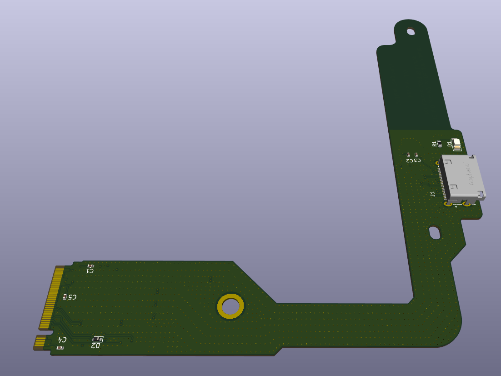
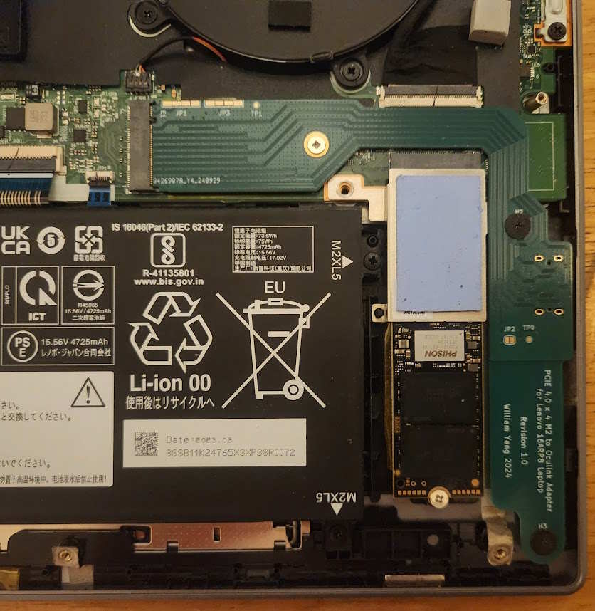
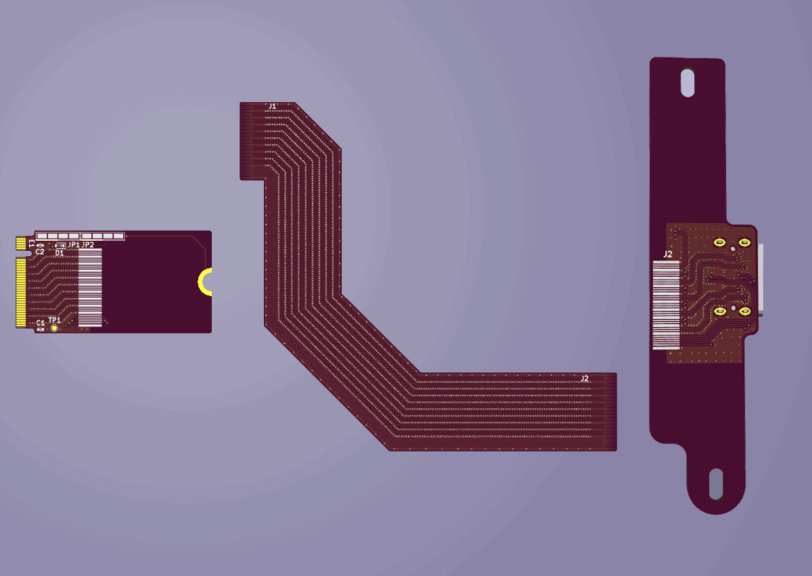
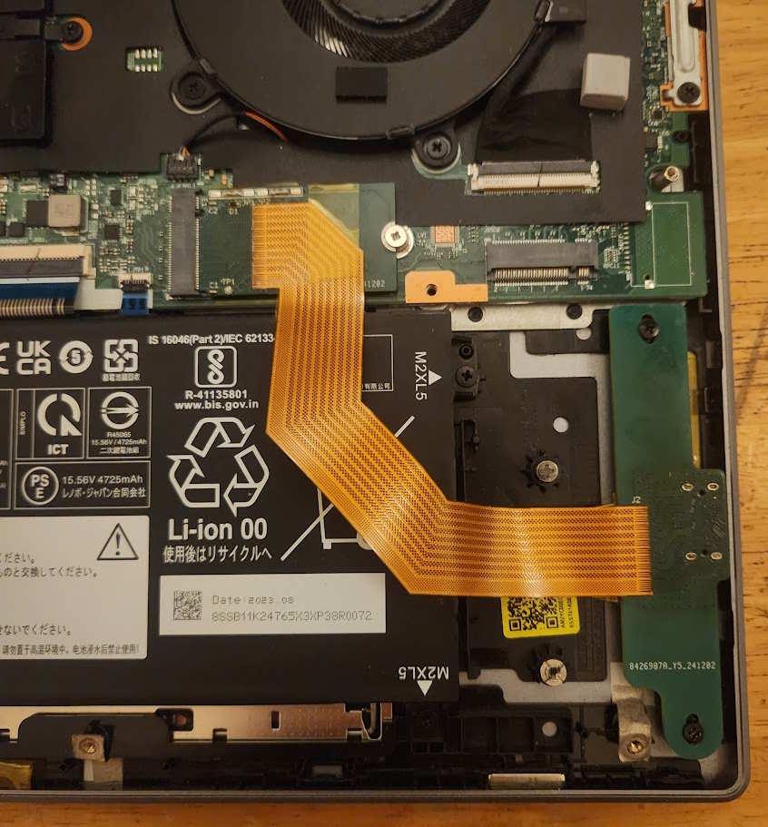
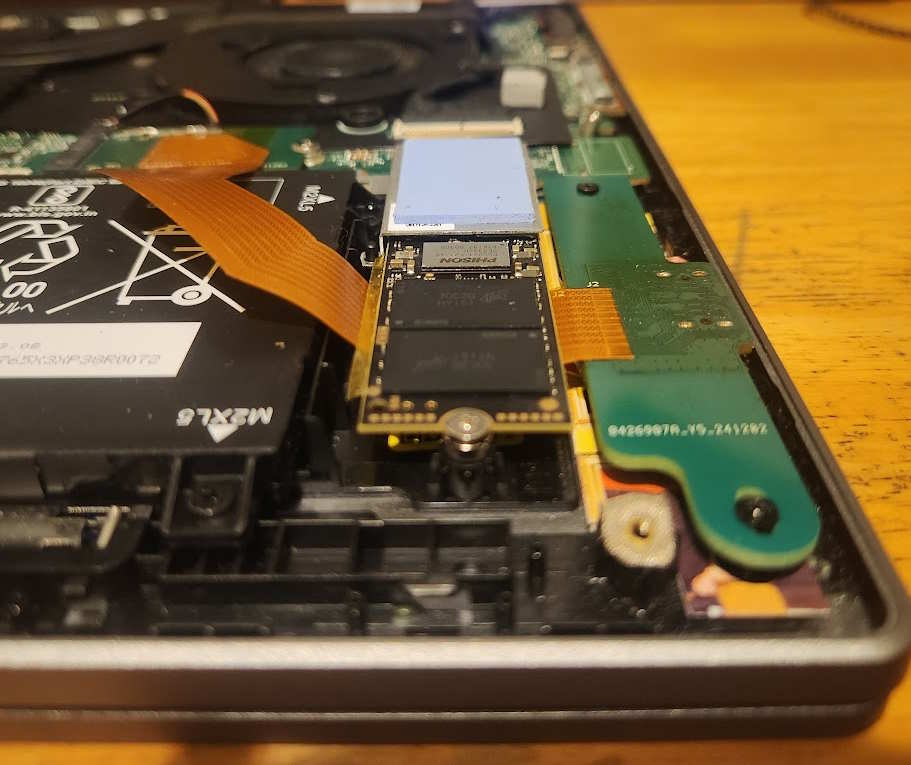

# Introduction
[](https://github.com/williamyang98/oculink_m2_adapter/actions/workflows/hugo-deploy.yml)

Open source M.2 to Oculink adapter for the Lenovo Ideapad Pro 5 16ARP8 laptop. Includes a single board design and a flexible two board design.

Documentation on design, manufacturing and benchmarks can be found [here](https://williamyang98.github.io/oculink_m2_adapter/docs/)

## Single board design



## Flexible two board design




# Project guide
| Directory | Description |
| --- | --- |
| ```docs``` | Location of hugo docs which are published to [github pages](https://williamyang98.github.io/oculink_m2_adapter/docs/) |
| ```kicad``` | Location of KiCAD schematic and PCBs files |
| ```simuations``` | Location of openEMS Python simulations for parametric optimisation of transmission line hatched ground plane and tapers |
