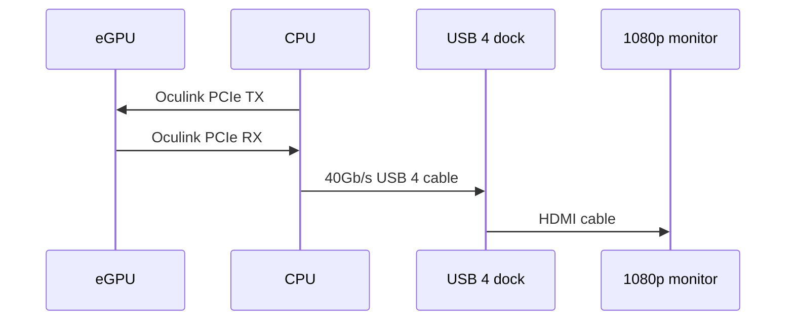

## Display setup

- Benchmark output display is connected to a USB 4 dock (40Gb/s) and has a resolution of 1080p.
- This means Oculink PCIe connection has to be stable in both the transmit and receive direction.
- When eGPU data comes back to CPU it actually goes through the integrated AMD 680m based on copy activity in task manager.

## Flexible PCB and single board design


  

    }}" style="max-height: 200px">
  

  

    }}" style="max-height: 220px">
  



- Both the flexible PCB multi-board design and single board design achieved PCIe 3.0 speeds.
- Their results across all synthetic benchmarks were identical.
- PCIe 3.0 connection was stable and bandwidth reached theoretical values.
- PCIe 4.0 could not be achieved at all.

## Aliexpress PCIe 4.0 adapters


  

    }}">
  

  

    }}" style="max-height: 220px">
  



- Both the adapters that came with the Adtlink eGPU and the silver plated 12cm adapter reached PCIe 4.0 speeds.
- PCIe 4.0 connection was stable and bandwidth reached theoretical values.
- Performance uplift from PCIe 3.0 to PCIe 4.0 in this setup is significant.
- Bandwidth limit from eGPU to CPU limits the number of frames that can be sent to display.
